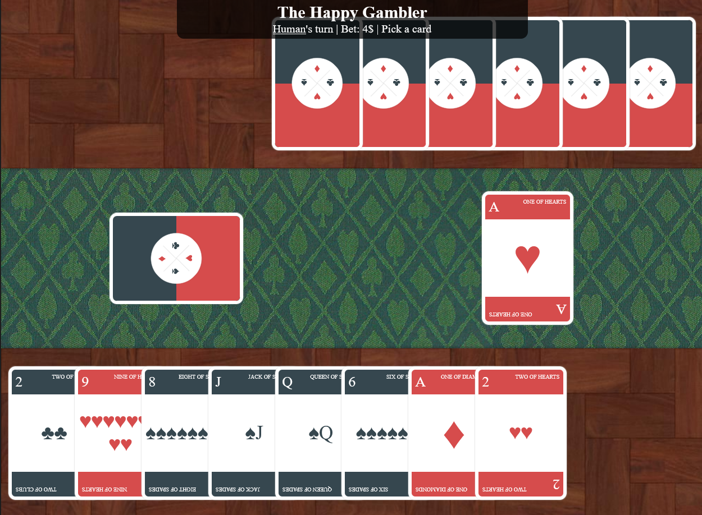

# Crazy 8s

Web programming assignment for Web Programming II

[Crazy Eights](https://en.wikipedia.org/wiki/Crazy_Eights) is a card game played with 2+ players. While the API supports an indefinite number of players, the UI only supports 2: 1 Human and 1 Bot.



# Pages

The pages were designed per the requirements of the assignment.

## Index

The Index page is the first page to user sees and features a skippable, 30-second animation.

## Intro

Registration form with some weird valiation rules. Could be used to submit to a leaderboard, but no back-end exists.

## Game

The actual game, have fun!

# Running

```bash
npm install # No dependencies, but needs to install TypeScript compiler
npx tsc # Compile TypeScript files
npx http-server # Serve http://127.0.0.1:8080/
```
